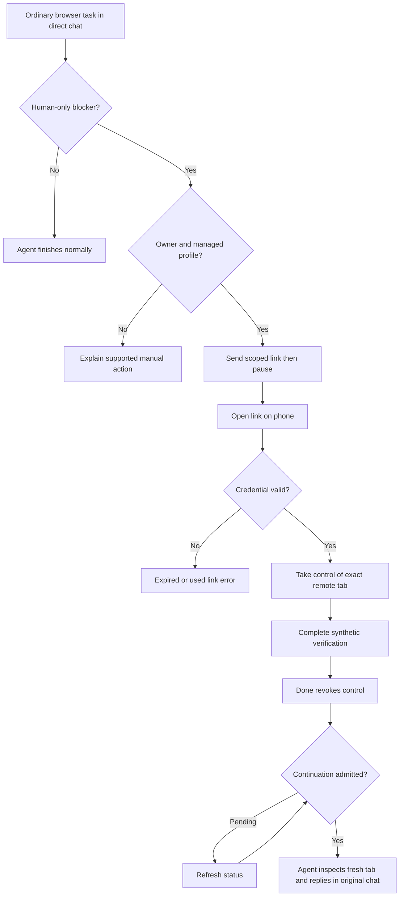
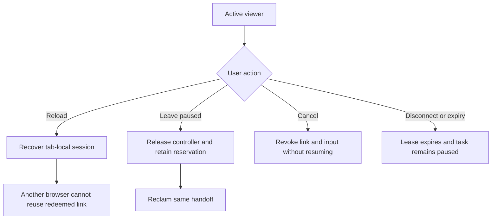

# Dogfood Report — feat/human-browser-handoff-pr

> Browser handoff PR #143015, candidate `c3b4fe1a`, tested on 2026-09-10.

## Diff Summary

- Managed browser tasks pause for human intervention and resume in the originating session.
- Single-use scoped links avoid Gateway administrator login and preserve URL prefixes.
- Current-turn notification, input authority, tab aliases, mobile coordinates, and pending status are repaired.

## Personas

- **Remote phone user** — complete a blocked browser step without server access; inferred from this task and VISION.md.
- **Private Gateway operator** — preserve authorization and recover cleanly; VISION.md security and reliability priorities.

No Compound Packs are declared.

## Flows Tested

## Test Matrix & Results

| #   | Flow      | Journey / Scenario                                                            | Status                       | Issue                                                                                      | Fix | Commit   |
| --- | --------- | ----------------------------------------------------------------------------- | ---------------------------- | ------------------------------------------------------------------------------------------ | --- | -------- |
| 1   | Entry     | Candidate installation, valid config, healthy Gateway and Telegram            | Pass                         | Managed update succeeded; 10,407 payload files match, install marker consumed normally     | -   | c3b4fe1a |
| 2   | Automatic | Ordinary task triggers link and pause without requesting handoff              | Blocked (needs human verify) | Requires an incoming owner Telegram message; CLI does not carry sender authority           | -   | c3b4fe1a |
| 3   | Viewer    | Fresh phone-size scoped entry opens without Gateway credentials               | Pass                         | Real installed Gateway, fresh browser session, 390px and 1280px; no Gateway login          | -   | c3b4fe1a |
| 4   | Input     | Exact remote tab, accurate tap, text input, scrolling and accessible controls | Blocked (needs human verify) | Awaiting a real owner-initiated handoff; Android additionally requires the physical device | -   | c3b4fe1a |
| 5   | Resume    | Done revokes input and original task continues from fresh page state          | Blocked (needs human verify) | Awaiting a real owner-initiated handoff; Android additionally requires the physical device | -   | c3b4fe1a |
| 6   | Reentry   | Reload and leave/reclaim preserve only the authorized handoff                 | Blocked (needs human verify) | Awaiting a real owner-initiated handoff; Android additionally requires the physical device | -   | c3b4fe1a |
| 7   | Rejection | Invalid credential rejects with an actionable error                           | Pass                         | HTTP 403 and expired/used-link guidance, no console errors                                 | -   | c3b4fe1a |
| 9   | Rejection | Redeemed-link reuse, cancellation, and live input revocation                  | Blocked (needs human verify) | Requires a real owner-initiated handoff; automated boundary coverage already passed        | -   | c3b4fe1a |
| 8   | Android   | Actual Android/Tailscale link opening and completion                          | Blocked (needs human verify) | Awaiting a real owner-initiated handoff; Android additionally requires the physical device | -   | c3b4fe1a |

## Pack Compliance

None.

## What Was Fixed

No additional code fixes during this run. Candidate contains the previously verified review repairs.

## Paper Cuts (by persona)

No new paper cuts in the entry/error paths. Successful control and completion still require live verification.

## Console Errors

No page or console errors in the tested entry/error paths. During the managed restart, the scoped endpoint returned expected HTTP 503 and the viewer showed a retry message. After update completion, invalid credentials returned HTTP 403 and the specific expired/used-link message.

## Human Verifications

Incoming owner Telegram task and actual Android interaction are pending. The operator was asked to send an ordinary browser task against the harmless local verification fixture, without mentioning handoff. Read-only history inspection found no matching task yet. Automated desktop emulation is not Android proof.

## Decisions for a Human

No product decision required. The real external turn must come from the owner; do not manufacture sender or restart-recovery authority.

## Learnings

Gateway health may pass briefly before the updater performs its final restart. Wait for the updater to report success and recheck both health and request admission. This run encountered two normal shutdown-drain deadlines with three pre-existing active tasks; no forced stop or unrelated task mutation was performed.

### Pack candidates

None.

## Final Status

Installed and ready for the interactive dogfood task, but not end-to-end verified and not declared merge-ready. All remaining scenarios require the external owner turn or physical Android verification; they were not silently passed. Candidate proof reused because no source code changed: focused browser/UI regressions, production and changed-test typechecks, targeted lint, full build, package integrity, and mocked browser smoke passed. The broad repository changed check was deliberately stopped during unrelated core-test typechecking and is not a complete pass. The repository-required proportional test scope was used; no whole-repository suite pass is claimed. The dogfood run used the agent-browser CLI against the installed Gateway. The verified state archive and previous package/service were retained for rollback.
